# 课程笔记

## 课程简介

**课程目录**

- Protocol Buffer 简介
- gRPC 简介
- Go 语言的例子
- ASP.NET Core 的例子
- C++ 的例子

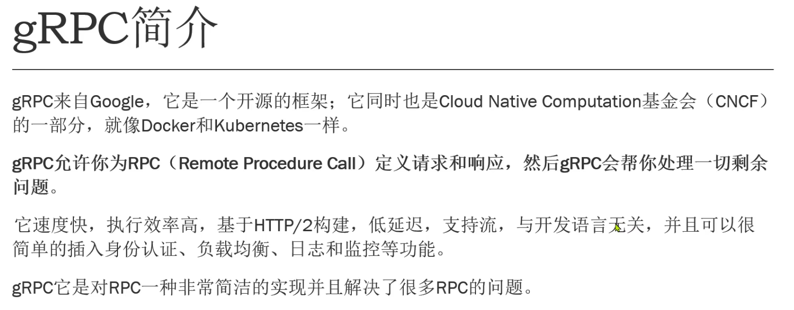

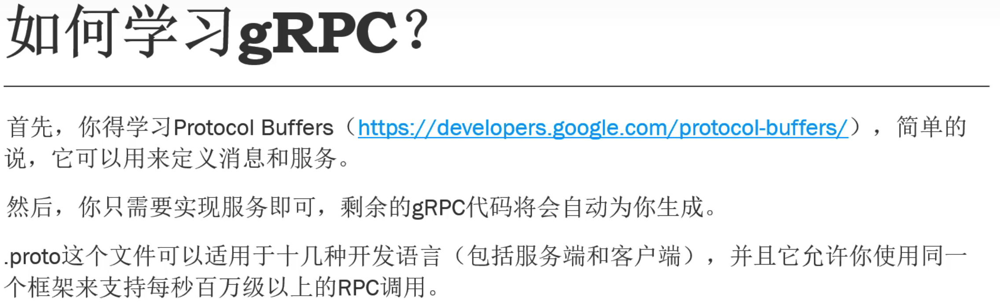

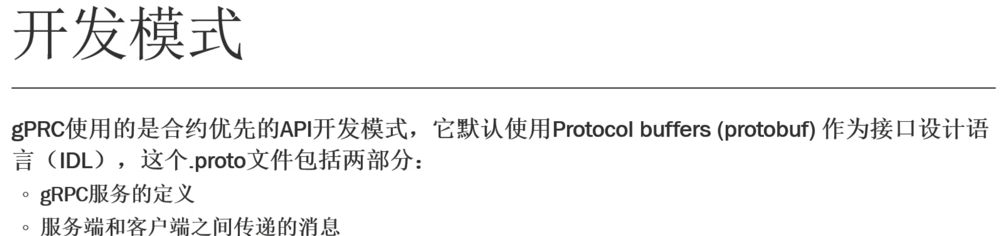

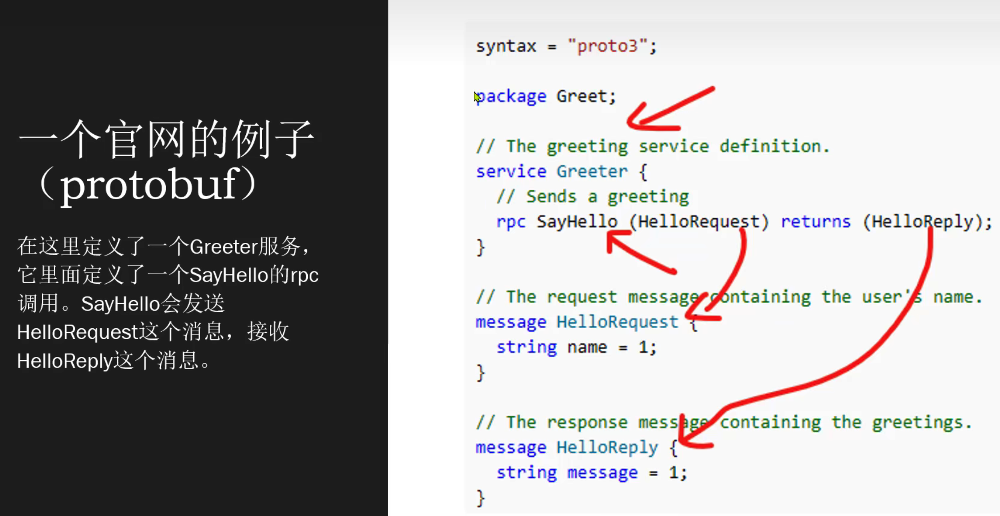

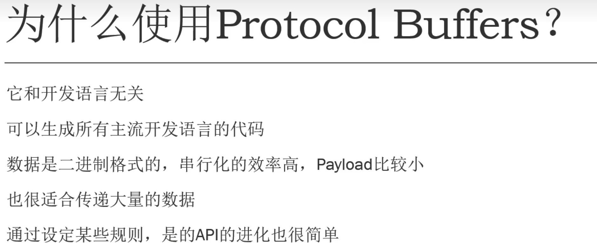

## Protocol Buffer 消息定义

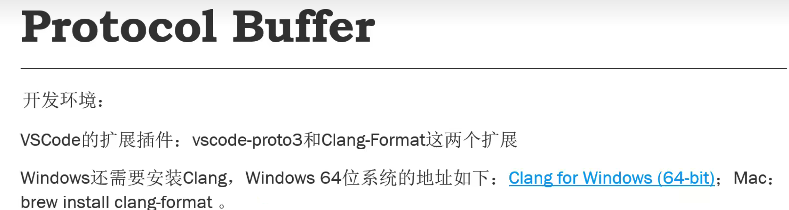

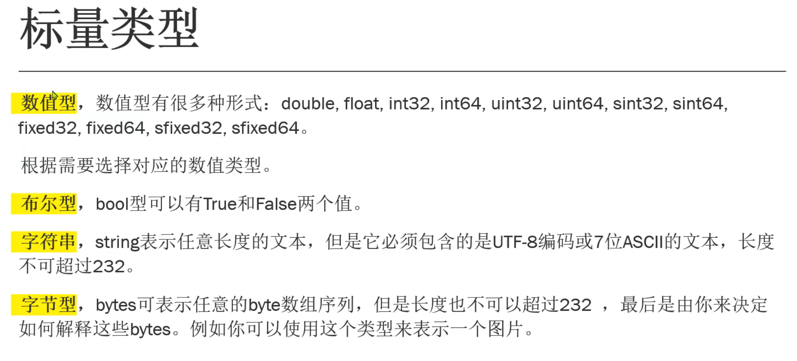

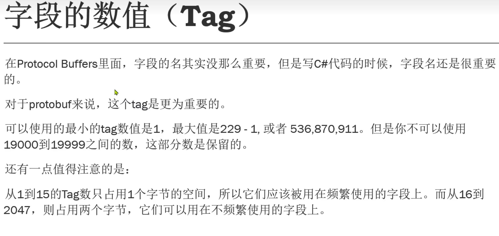

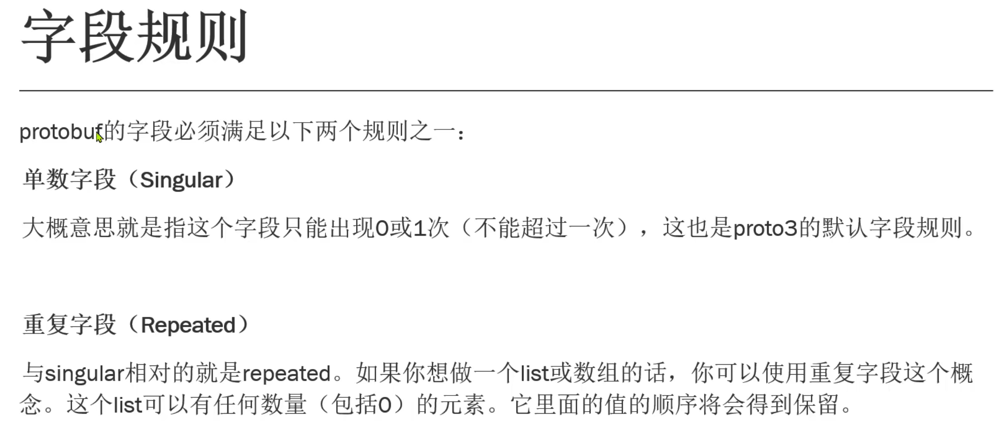

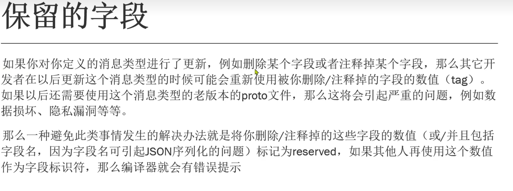

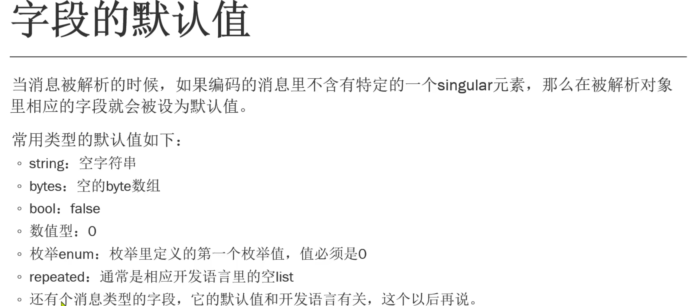

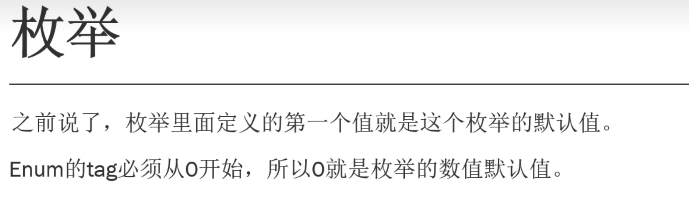

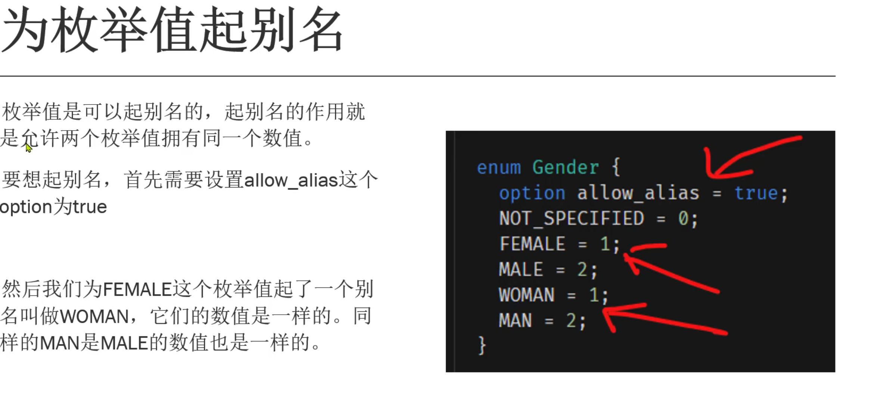

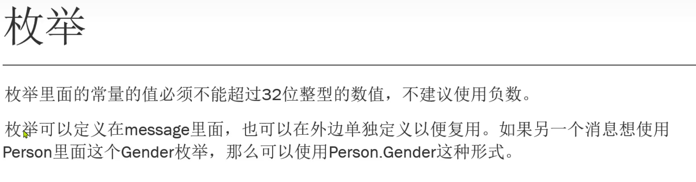

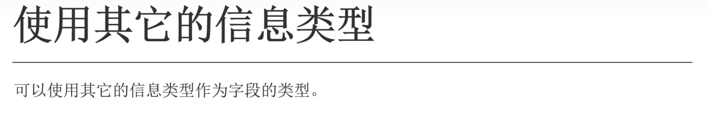

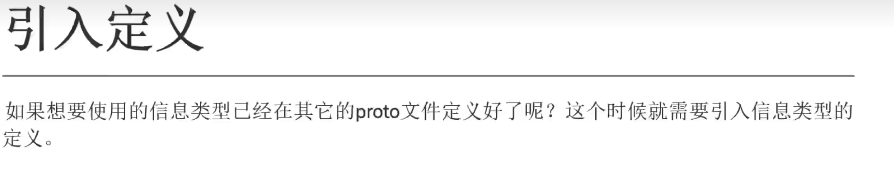

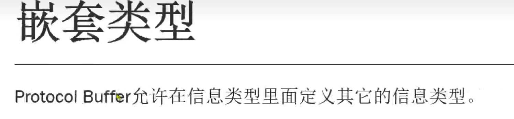

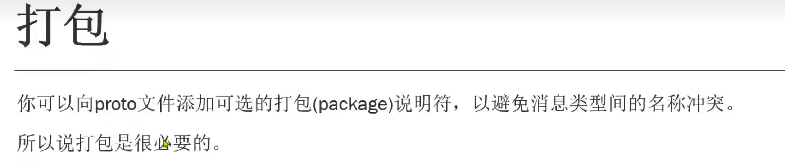

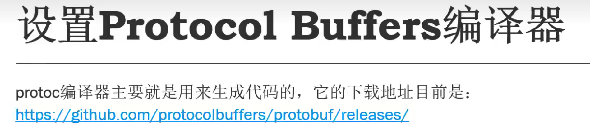

`protoc date.proto --csharp_out=csharp`

## 03. Protocol Buffer Go 语言示例

