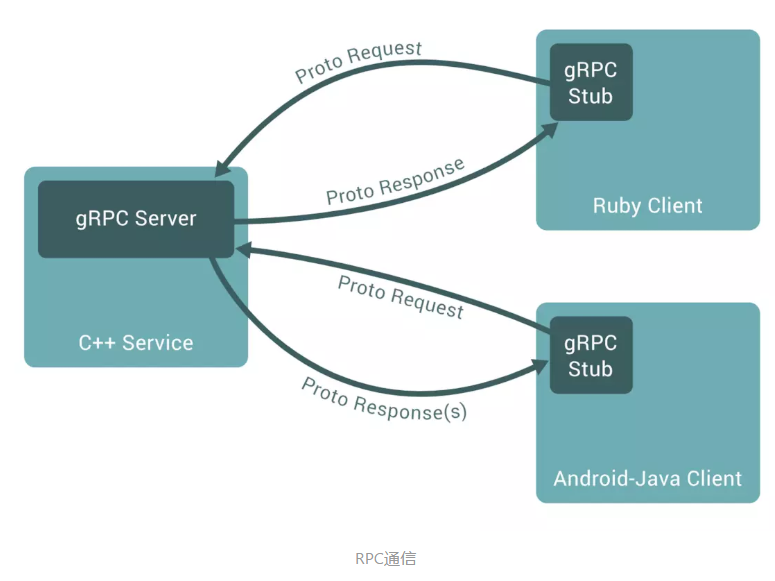
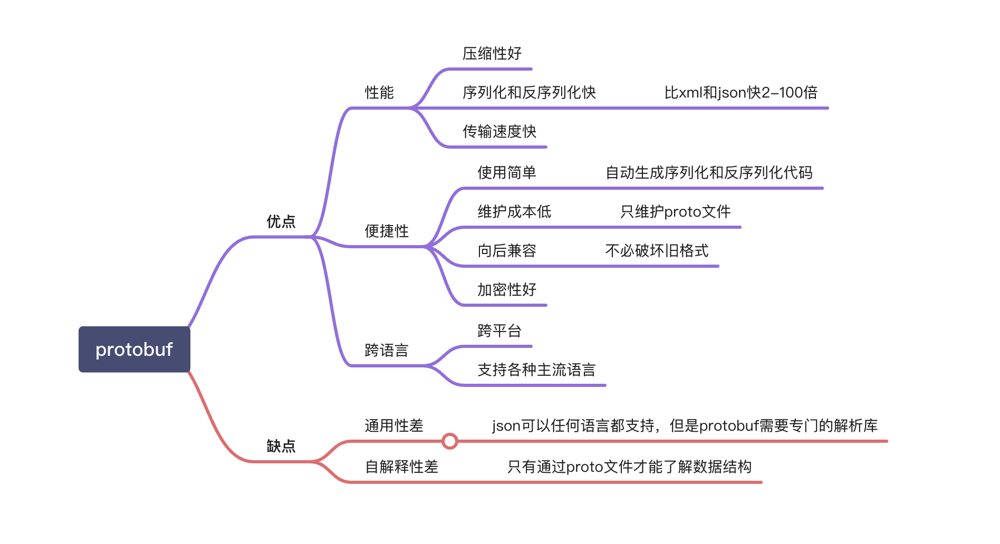

## gRPC 入门

### 1. 什么是 grpc 和 protobuf

#### gRPC

gRPC 是一个高性能、开源和通用的 RPC 框架，面向移动和 HTTP/2 设计。目前提供 C、Java 和 Go 语言版本，分别是：[grpc](https://github.com/grpc/grpc), [grpc-java](https://github.com/grpc/grpc-java), [grpc-go](https://github.com/grpc/grpc-go). 其中 C 版本支持 [C](https://github.com/grpc/grpc), [C++](https://github.com/grpc/grpc/tree/master/src/cpp), [Node.js](https://github.com/grpc/grpc/tree/master/src/node), [Python](https://github.com/grpc/grpc/tree/master/src/python), [Ruby](https://github.com/grpc/grpc/tree/master/src/ruby), [Objective-C](https://github.com/grpc/grpc/tree/master/src/objective-c), [PHP](https://github.com/grpc/grpc/tree/master/src/php) 和 [C#](https://github.com/grpc/grpc/tree/master/src/csharp) 支持.

#### protobuf

`Protocol Buffer` 是 `Google` 推出的一种轻量 & 高效的结构化数据存储格式。

- [protobuf 官方仓库](https://github.com/protocolbuffers/protobuf)
- [golang/protobuf](https://github.com/golang/protobuf)

